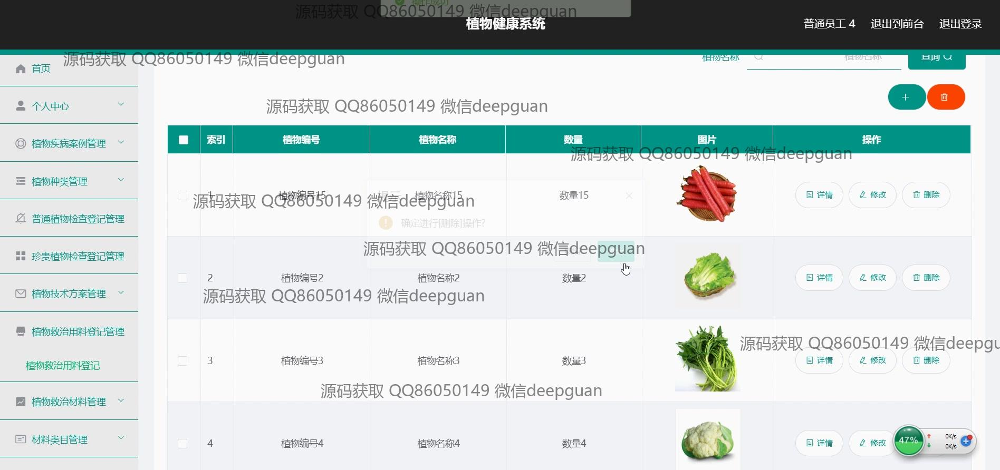
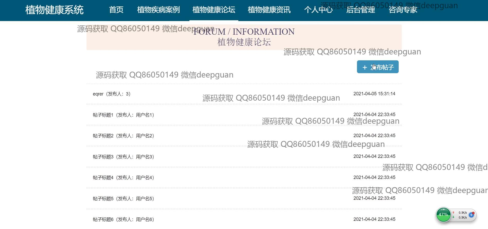
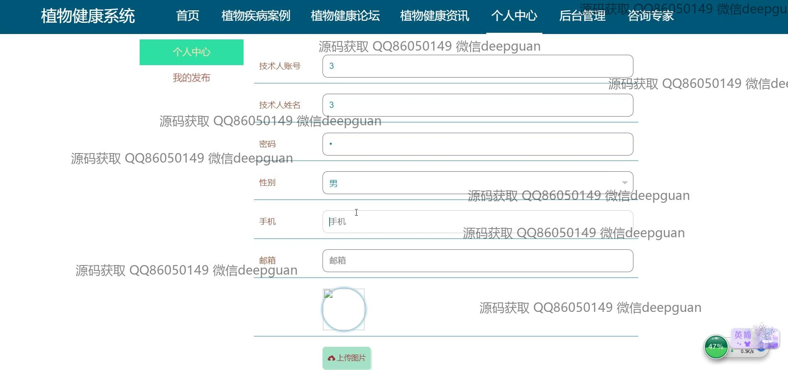
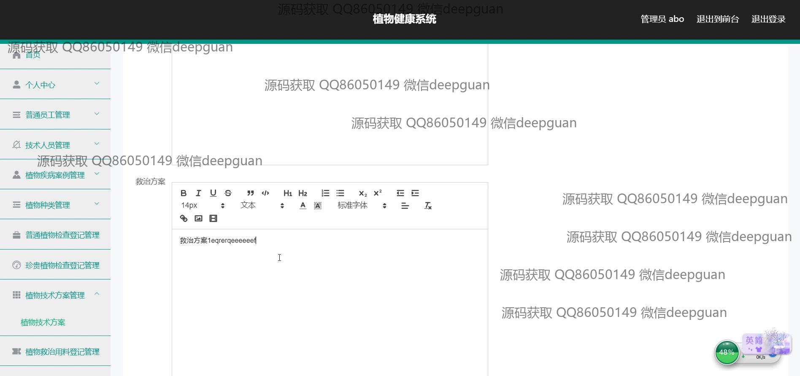

<h1 align="center">植物健康系统</h1>

## 简介
植物健康系统：基于Spring Boot开发，角色分为管理员、普通员工和技术人员；功能包括植物疾病案例管理、植物种类管理、健康监测、数据分析及论坛交流，支持植物信息的详细管理和维护。    --计算机毕业设计源码；毕设源码；java毕业设计源码

## 联系方式

<h3 align="center">获取完整代码与数据库文件 + 微信：deepguan QQ: 86050149 QQ群: 783742310</h3>

<h3 align="center">可帮忙远程部署 包运行成功！提供远程部署、修改代码、设计文档指导、代码讲解等服务！</h3>

## 功能介绍（完整见运行截图）
管理员： 基本功能包括系统登录与退出功能，进入系统后可进行员工和技术人员的账户管理，查看与更改个人资料。拥有对整个网站的后台管理权限，管理与操作包括植物疾病案例、植物种类、植物检查登记、技术方案及救治材料。管理员还负责管理论坛帖子的发布和审核，以确保信息质量与规范。其具备整体系统监控能力辅助决策和协调各项功能模块。

技术人员： 基本功能为在系统中登录以管理个人信息，查看并编辑植物健康的数据，管理与维护植物疾病案例，提出并保存技术方案以支持植物健康的监测与分析。技术人员能够进入特定模块中进行疾病诊断与植物健康评估，提供科学的养护和救治建议。通过上传与编辑功能进行详细的植物数据记录，有效帮助提升系统信息完整性与可靠性。

普通员工： 拥有登录权限，可以查看并编辑个人资料，进行植物相关信息的录入与管理，普及于疾病案例记录。参与系统数据维护，植保方案的执行，协助技术人员进行信息更新。通过导航菜单进入不同模块进行操作，包括对植物种类、疾病案例和检查登记管理，较为基础和常规的功能帮助普通员工提升工作效率。

用户： 用户可以在页面注册和登录系统，以获得植物健康资讯，包括植物健康论坛的使用。用户能够在个人中心管理个人信息，记录与保存植物健康数据，获取疾病诊断与种养护建议等。通过首页导航轻松访问植物健康相关模块，参与讨论以获取知识和帮助，享受系统提供的便捷性与高效性带来更好的用户体验。

## 运行截图

本代码来源于网络,仅供学习参考使用!

